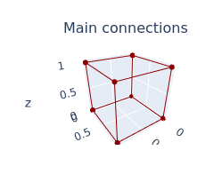
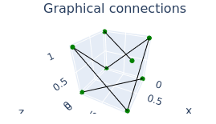
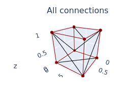

# Chaikin3D
Expansion of the Chaikin Algorithm to the 3rd dimension (polyhedral approximation).

**_IMPORTANT NOTE_**: Some features are currently broken. Will fix them after my finals :)

## Installation

You need to have python (version 3+) and pip installed.

Then, download the repo:
```
git clone https://github.com/Nicolas-Reyland/Chaikin3D
```

Then you will need *plotly* and *matrix*. You can install plotly with pip:
```
pip install plotly
```
You MAY want matplotlib, but it is not mandatory:
```
pip install matplotlib
```
To install matrix, you need to get it from [my repo](https://github.com/Nicolas-Reyland/matrix). You can simply add the matrix.py file in this project's folder, but you can also install matrix.

If you wish to only use matrix for this project (which is very likely), enter these commands:
```
cd Chaikin3D
git clone https://github.com/Nicolas-Reyland/matrix
cp matrix/matrix.py .
rm -ri matrix # can remove the -i, but I don't want to be responsible for any damage
```

You can also install the matrix module, by following the instructions in the matrix repo.

__NOTE__: when installing matrix, if you fail to install the noise module (it can be a mess sometimes), you can simply chage this line: ```import numpy as np, random, noise``` to ```import numpy as np, random#, noise``` at the beginning of the matrix.py file (commenting out the noise module import). The noise module won't be used in *this* project.

If you are using Windows, download the matrix repo (https://github.com/Nicolas-Reyland/matrix) and copy the matrix.py file into the Chaikin3D folder.


## Some explanations first

This project supports more "exotic" polyhedron (a polyhedron is a polygon in space/3D) types. In fact, since we are going to change the polyhedron, raw data of the verticies isn't sufficient. We need info about which edges are important, and which are not. For example, in a cube, the diagonal edge (to split the square into two triangles) is not "important": its purpose is only to bind two vertices so that triangle can be drawn to the screen. That's why we need to distinguish *main* and *graphical* connections between our nodes (vertices).

That is why the polyhedral approximation of meshes that were loaded from *.obj* files are not always as wanted. There is no way to know if a connection between two nodes is really a part of the mesh or if its only purpose is to form triangles (you can normally only draw triangles). There are no "graphical" connections in those meshes :(
Every time a vertex list has more than 3 vertices in a mesh file, they are binded with graphical connections to form triangles (there are no other polygons than triangles that are drawn in this project)

Here are the main connections of a cube:



Here are the graphical connections of a cube:



Here are all the connections of a cube:



And when you draw all this:


For examples of what I mean with "graphical" connections, try these commands: ```python chaikin3d.py -s cube -p full -cg 0``` and ```python chaikin3d.py -s cube -p full -cg 1```. The grapchical connections are the black lines, while the main connections are the red lines.


## Usage

To get help, use the ```python chaikin3d.py -h``` command.

Note: every option takes an argument. If an option takes a boolean argument, then *1*, *t* and *true* (case insensitive) will mean "true". For "false", these are accepted values: *0*, *f*, *false* (case insensitive).

### Loading the polyhedron

Loading a polyhedron is the only thing you must do. You will get an error if you do not. If the only thing you do is loading a mesh, it will simply be drawn to the screen using the default settings.

#### Related Options:

 * ```-i```/```--input```
 * ```-e```/```--evaluate```

#### Input option

You will first have to select a polyhedron/mesh to render or use. You can load a *.obj* (only supported extension, for now) file using the ```-i``` (```--input```) option and appending the path like this:
```python chaikin3d.py -i data/dog.obj``` (if you try this and the mesh is somehow rotated, please add this to your command line: ```-rm true```).

#### Evaluate option

The ```-e```/```--evaluate``` option can be used in two ways (or more):

The evaluation options takes a string as input, which will be run as python code right after the loading of the polyhedron mesh file (if any has been given). You should use this option to generate your own polyhedrons or to customize the one that has been loaded. There are a few things you should know:

You have access, in the local variables to the following python objects:
 * ```Polyhedron``` (*polyhedron.py*)
 * ```WaveFrontReader``` (*wavefront_reader.py*)
 * ```Renderer``` (*plotly_renderer.py* / *mpl_renderer.py*)

The loaded polyhedron object is named ```poly```. If you did not load a file, there is no such variable. You then have to create it. When you create the ```poly``` variable, it must be of type ```Polhyhedron```.

#### Examples

Load a a cube, then apply the chaikin algorithm on it:
```
python chaikin3d.py -i data/cube.obj -e "poly = Polyhedron.Chaikin3D(poly)"
```
*Note: this is equivalent to ```python chaikin3d.py -i data/cube.obj -cg 1```*

Load a tetrahedron, then rotate it by 45° with code you potentially wrote in a file named "my_own_code.py":
```
python chaikin3d.py -i data/tetrahedron.obj -e "poly = __import__('my_own_code').rotate_tetrahedron(poly, 45)"
```

Generate a new polyhedron
```
python chaikin3d.py -e "poly = __import__('evaluations').generate_diamond(num_points = 25)"
```


### Chaikin Algorithm

#### Related Options:

 * ```-cg```/```--chaikin-generations```
 * ```-cc```/```--chaikin-coef```

#### Chaikin Generations

To choose the number of Chaikin generations (or iterations) you want to run on the given polyhedron, you should be using the ```-cg```/```--chaikin-generations``` option. The default value is 0. To run one iteration, you could use ```-cg 1``` (for 2 iterations : ```-cg 2```, you got it).

#### Chaikin Coeffiecient

You might also want to control the *Chaikin coefficient*. This is done using the ```-cc``` option. This value is used to *cut* the edges at 1/coef and (coef-1)/coef. George Chaikin chose "4" as beeing the right coefficient. This cust the edges into three parts: first 25%, 50%, 25% ([2D Chaikin's Corner Cutting Algorithm](https://sighack.com/post/chaikin-curves)).

#### Examples

One generation on a cube
```python chaikin3d.py -i data/cube.obj -cg 1```

Two generations on a deeer (yes, a deer)
```python chaikin3d.py -i data/deer.obj -cg 2```

One iteration on a tetrahedron, with a coefficient of 3
```python chaikin3d.py -i data/tetrahedron.obj -cg 1 -cc 3```


### Graphical Options

You can now choose how you'd like to draw your mesh and what exactly you'd like to draw. This is done using the folloying options:
 * ```-p``` or ```--plot```
 * ```-a``` or ```--alpha```
 * ```-r``` or ```--renderer``` (DO NOT USE)
 * ```-smc``` or ```--show-main-connections```
 * ```-sgc``` or ```--show-graphical-connections```
 * ```-rm``` or ```--rotate-mesh``` (only with the ```-i``` option)
 * ```-nc``` or ```--node-color```
 * ```-pc``` or ```-polygon-color```
 * ```-mcc``` or ```--main-connection-color```
 * ```-gcc``` or ```--graphical-connection-color```

There are 4 types of plots (see examples below):
 * "simple" plot : this plot only draws your polyhedron to the screen
 * "full" plot : this one draws a lot of data separately: your connections (by type, etc.), your vertices and different mesh representations. Useful for understanding how things work and debugging in general
 * "evolution" plot : the evolution plot takes into account the number of chaikin generations that you want (```-cg``` option). I will render one generation after another in a grid-format (like the "full" plot)
 * "animation" plot (DO NOT USE) : this plot should, in theory, create an animation, rendering all the chaikin generations from 0 to the value given in the ```-cg``` option
The default value is "simple"

The ```-a```/```--alpha``` switch allows you to change the alpha/opacity value (ranging from 0.0 to 1.0) of the faces in the "simple", "evolution" and "animation" plots (every plot except the "full" plot <- there are already alpha changes). Default value: 0.8

You should not mess with the ```-r```option, but it exists (even I don't mess with -> the mpl renderer is BROKEN). Default value: "plotly"

The ```-smc``` switch allows to choose if you want to render the main connections for the "simple", "evolution" and "animation" plots. Default value: "true"

The ```-sgc``` switch allows to choose if you want to render the graphical connections for the "simple", "evolution" and "animation" plots. Default value: "false"

Use the ```-rm```/```--rotate-mesh``` to rotate meshes that look ... rotated **on load** (therefore, you can only use this option with the ```-i```/```--input``` option).

The ```-nc```, ```-pc```, ```-mcc``` and ```-gcc``` options let you customize the colors for the nodes (df. green), polygons (df. lightblue), main connections (df. darkred) and graphical connections (df. black). You can give color-names or colors with this format: *#12ab34*. The value *random* is valid and will generate a new random color for each node/polygon/main connection/graphical connection.

### Other Options


There is a ```-v```/```--verbose``` switch too. If you turn it on, you will get info about the chaikin algorithm progress. This might be useful for meshes with a lot of vertices or when having a lot of iterations. The default value is "false".


## Examples

Here are some examples of what can be done:

CMD: ```python chaikin3d.py -i data/dog.obj -rm true -sgc true```


CMD: ```python chaikin3d.py -i data/dog.obj -rm true -sgc true -cg 1```


CMD: ```python chaikin3d.py -s cube -p evolution -cg 5```


CMD: ```python chaikin3d.py -s triangle -p full -cg 1 -cc 3```


*The "solid" statement means that the alpha value of the triangles has been set to 1.0 (no transparency)*

CMD 1: ```python chaikin3d.py -i data/deer.obj -rm true -a 1.0```

CMD 2: ```python chaikin3d.py -i data/deer.obj -rm true -a 1.0 -smc false```

 

CMD 1: ```python chaikin3d.py -i data/deer.obj -rm true -a 1.0 -smc true -cg 1 -v 1``` (verbose switch not mandatory)

CMD 2: ```python chaikin3d.py -i data/deer.obj -rm true -a 1.0 -smc true -cg 1 -v 1``` (verbose switch not mandatory)

 

*There are 25486 nodes in the last deer mesh. Loading thoses meshes should take at least a few minutes.*


## TODO
 * Fix issue where plotly would just freeze the program (Windows only & might be a plotly issue ?)
 * Better memory optimization (should come with C/C++ FFI implementation)
 * Save result to .obj file (keeping original textures ??)
 * Finsh animation plot
 * Optimization of the Chaikin3D algorithm
     - maybe parallelism ?
     - FFI with C++ or C (much more likely to happen than parallelism + much faster)
 * Fix issue of python crashing (no errors, just crashing) when trying to apply chaikin3D on a large number of nodes & connections
 * Change scale when plotting (e.g. data/cat.obj)


## Note
If you have any issues using this project or need any help, please feel free to tell me [on github](https://github.com/Nicolas-Reyland/Chaikin3D/issues) !
If you want to help me developping this project, please tell me too !


*Author: Nicolas Reyland*
