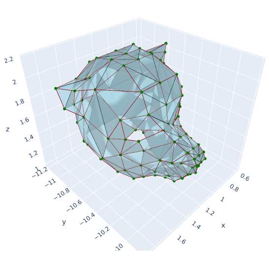
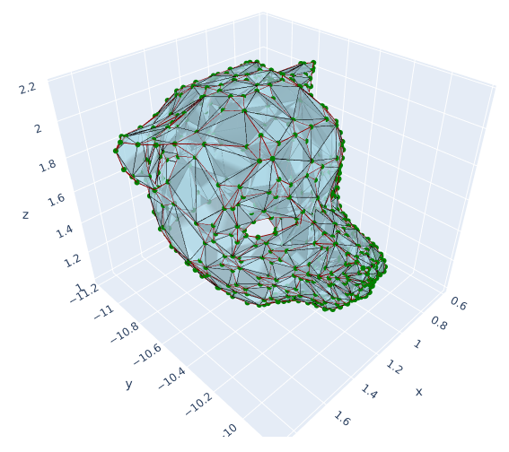

# Chaikin3D
Expansion of the Chakin Algorithm to the 3rd dimension.

## Installation

You need to have python (version 3+) and pip installed.

Then, download the repo:
```
git clone https://github.com/Nicolas-Reyland/Chaikin3D
```

Then you will need *plotly* and *matrix*. You can install plotly with pip:
```
pip install plotly
```
You MAY want matplotlib, but it is not mandatory:
```
pip install matplotlib
```
To install matrix, you need to get it from [my repo](https://github.com/Nicolas-Reyland/matrix). You can simply add the matrix.py file in this project's folder, but you can also install matrix.

If you wish to only use matrix for this project (which is very likely), please enter these commands:
```
cd Chaikin3D
git clone https://github.com/Nicolas-Reyland/matrix
cp matrix/matrix.py .
```

If you are using Windows, download the matrix repo (https://github.com/Nicolas-Reyland/matrix) and copy the matrix.py file into the Chaikin3D folder.


## Some explanations first

This project supports more "exotic" polygon types. In fact, since we are going to change the polygon, raw data of the verticies isn't sufficient. We need info about which edges are important, and which are not. For example, in a cube, the diagonal edge (to split the square into two triangles) is not "important": its purpose is only to bind two vertices so that triangle can be drawn to the screen. That's why we need to distinguish *main* and *graphical* connections between our nodes (vertices).

That is why the polygonal approximation of meshes that were loaded from *.obj* files are not perfect. There is no way for me to know if a connection between two nodes is really a part of the mesh or if its only purpose is to form triangles (you can normally only draw triangles). There are no "graphical" connections in those meshes :(

Here are the main connections of a cube:


Here are the graphical connections of a cube:


Here are all the connections of a cube:


And when you draw all this:


For examples of what I mean with "graphical" connections, try these commands: ```python3 chaikin3d.py -s cube -p full -c 0``` and ```python3 chaikin3d.py -s cube -p full -c 1```. The grapchical connections are the black lines, while the main connections are the red lines.


## Usage
Not that you can use the ```python3 chaikin3d.py -h``` command.

Another note: every option takes an argument. If an option takes a boolean argument, then *1*, *t* and *true* (case insensitive) will mean "true". For "false", these are accepted values: *0*, *f*, *false* (case insensitive).

You will first have to select a polygon/mesh to render or use. There are two options: you can load a *.obj* file using the ```-i``` (```--input```) option and appending the path like this:
```python3 chaikin3d.py -i data/dog.obj``` (if you try this and the mesh is rotated, please add this: ```-rm true``` option).
You can also use the ```-s``` (```--shape```) option to load a predefined polygon. They are defined in the *basic_shapes.py* file. You can define your own polygons in there. You can, for example, use ```python3 chaikin3d.py -s cube``` or ```python3 chaikin3d.py -s triangle```. If you wish to add your own shapes, please take a look at the file and add your own! You only need to create a function which returns a *polygon.Polygon* object and append it's name after the ```-s``` option to load it.
If you only load a polygon, it will simply be drawn.


Then, you can choose the number of Chaikin generations (or iterations) you want to run on the given polygon. That is done using the ```-c``` (```--chakin```) option. The default value is 0. To run one iteration, you could use ```python3 chaikin3d.py -s triangle -c 1```.
You might also want to control the Chaikin coefficient. This is done using the ```-cc``` option.
Here is an example usage: ```python chaikin3d.py -s cube -c 3 -cc 3```. The default value is 4.

There is a ```-v```/```--verbose``` switch too. If you turn it on, you will get info about the chaikin algorithm progress. This might be useful for meshes with a lot of vertices or when having a lot of iterations. The default value is "false".

You can now choose how you'd like to draw your mesh and what exactly you'd like to draw. This is done using the folloying options:
 * ```-p``` or ```--plot```
 * ```-a``` or ```--alpha```
 * ```-r``` or ```--renderer``` (DO NOT USE)
 * ```-smc``` or ```--show-main-connections```
 * ```-sgc``` or ```--show-graphical-connections```
 * ```-rm``` or ```--rotate-mesh``` (only with the ```-i``` option)

There are 4 types of plots (see examples below):
 * "simple" plot : this plot only draws your polygon to the screen
 * "full" plot : this one draws a lot of data separately: your connections (by type, etc.), your vertices and different mesh representations. Useful for understanding how things work and debugging in general
 * "evolution" plot : the evolution plot takes into account the number of chaikin generations that you want (```-c``` option). I will render one generation after another in a grid-format (like the "full" plot)
 * "animation" plot (DO NOT USE) : this plot should, in theory, create an animation, rendering all the chaikin generations from 0 to the value given in the ```-c``` option
The default value is "simple"

The ```-a```/```--alpha``` switch allows you to change the alpha/opacity value (ranging from 0.0 to 1.0) of the faces in the "simple", "evolution" and "animation" plots (every plot except the "full" plot <- there are already alpha changes). Default value: 0.8

You should not mess with the ```-r```option, but it exists (even I don't mess with -> the mpl renderer is BROKEN). Default value: "plotly"

The ```-smc``` switch allows to choose if you want to render the main connections for the "simple", "evolution" and "animation" plots. Default value: "true"

The ```-sgc``` switch allows to choose if you want to render the graphical connections for the "simple", "evolution" and "animation" plots. Default value: "false"

Use the ```-rm```/```--rotate-mesh``` to rotate meshes that look ... rotated **on load** (therefore, you can only use this option with the ```-i```/```--input``` option).


## Examples

Here are some examples of what can be done:

CMD: ```python3 chaikin3d.py -i data/dog.obj -rm true```


CMD: ```python3 chaikin3d.py -i data/dog.obj -rm true -c 1```


CMD: ```python3 chaikin3d.py -s cube -p evolution -c 5```


CMD: ```python3 chaikin3d.py -s triangle -p full -c 1 -cc 3```


CMD 1: ```python3 chaikin3d.py -i data/deer.obj -rm true -a 1.0```

CMD 2: ```python3 chaikin3d.py -i data/deer.obj -rm true -a 1.0 -smc false```

 

CMD 1: ```python3 chaikin3d.py -i data/deer.obj -rm true -a 1.0 -smc true -c 1 -v 1``` (verbose switch not mandatory)

CMD 2: ```python3 chaikin3d.py -i data/deer.obj -rm true -a 1.0 -smc true -c 1 -v 1``` (verbose switch not mandatory)

 

*There are 25486 nodes in the last two deer meshes*


## TODO
 * Ability to change the color of triangles, nodes & connections (by type)
 * Better memory optimization (should come with C/C++ FFI implementation)
 * Save result to .obj file (keeping original textures ??)
 * Chaikin group ordering & connection on load when encountering faces with more than 3 vertices
 * Finsh animation plot
 * Better Chaikin group detection
 * Optimization of the Chaikin3D algorithm
     - maybe parallelism ?
     - FFI with C++ or C (much more likely to happen than parallelism + much faster)
 * Fix issue of python crashing (no errors, just crashing) when trying to apply chaikin3D on a large number of nodes & connections
 * Save the chaikin groups on-load & chaikin group inheritance
 * Change scale when plotting (e.g. data/cat.obj)


## Note
If you have any issues using this project or need any help, please feel free to tell me on github !
If you want to help me developping this project, please tell me too !


*Author: Nicolas Reyland*
