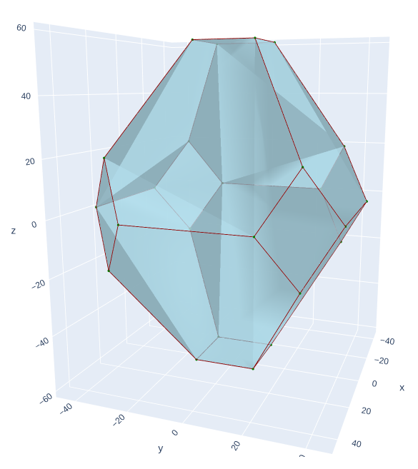
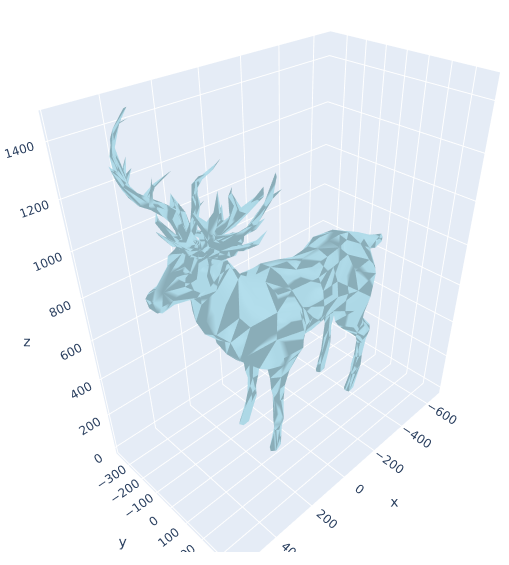
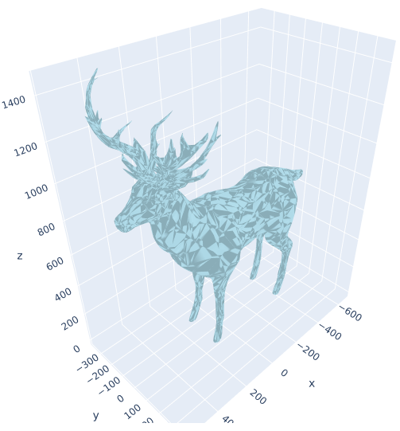
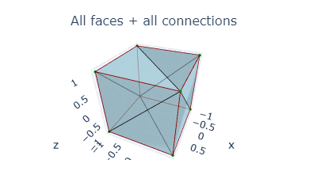

# Chaikin 3D

Expansion of the Chaikin Algorithm to polyhedrons (3D).

The idea behind this project is to expand Chaikin's corner cutting algorithm to 3d polyhedrons. Now you could argue (and you would be right) and tell me that Chaikin's algorithm is made for splines and lines, not for polygons directly. That might be true, but the algorithm implemented in this project is aimed at reproducing _the effect the corner cutting algorithm has on polygons_ ... on polyhedrons. The corners should be _cut_. Sadly, this is not as easy in 3D space than it is on a 2D plane. In a polyhedron, the vertices can have a potentially infinite number of edges connected to them, whereas in a polygon on a 2D plane, a vertex would only have 2 edges connected to it.

Basically, it looks like this :


# Contents

 - [Contents](#contents)
 - [Installation](#installation)
 - [Usage](#usage)
 - [Examples](#examples)
 - [Some explanations](#some-explanations)
 - [Todo](#todo)
 - [Note](#note)


# Installation

You need to have python (version 3+) and pip installed.

Then, clone the repo:
```
git clone https://github.com/Nicolas-Reyland/Chaikin3D
```

Then you will need some python packages :
```
pip install -r requirements
```

# Usage

To get help, use the ```./chaikin3d.py -h``` command.
See the [additional info tab](#additional-info) to get info about how exactly to enter your values.

For the rest of this README, let's consider the following words as synonyms: _polyhedron_, _mesh_, _model_. They might not mean the same thing, but repeating _polyhedron_ 10 thousand times is not cool either.

## Loading the polyhedron

Loading a polyhedron is the only thing you must do. You will get an error if you do not. If the only thing you do is loading a mesh, it will simply be drawn to the screen using the default settings.

### Related Options:

 * ```-i```/```--input```
 * ```-rm```/```--rotate-mesh```
 * ```-oe```/```--order-edges```

### Input file

You will first have to select a polyhedron/mesh to render or use. You can load a *.obj* (only supported extension, for now) file using the ```-i``` (```--input```) option like this: ```python chaikin3d.py -i example-meshes/dog.obj``` (if you try this and the mesh is somehow rotated, please add this to your command line: ```-rm true```).

[Here](https://people.sc.fsu.edu/~jburkardt/example-meshes/obj/obj.html) is a link to lots of *.obj* files which you can download and test. You only need the *.obj* file. Only vertices and faces are read by the program.

**Note**: A `-e` argument was previously available, but was removed because of python compilations issues ([see python compilation docs](https://docs.python.org/3/library/functions.html#compile)).

### Mesh transformations

There are two mesh transformations that can be applied : `-rm` and `-oe`.

Use the ```-rm```/```--rotate-mesh``` to rotate meshes that look ... rotated **on load** (therefore, you can only use this option with the ```-i```/```--input``` option).

The `-oe`/`--order-edges` option applies the edge-ordering algorithm on the mesh when applying the Chaikin3D algorithm. There are three possible values for this option: `none`, for never applying the edge-orering algorithm, `first`, for only applying the edge-ordering before the first run of the Chaikin3D algorithm, and `all`, which will run the edge-ordering algorithm before any Chaikin3D run.

The edge-ordering algorithm comes in handy when your mesh data is not properly setup for the Chaikin3D algorithm (see [this section](#some-explanations)). For example, if you load the diamond mesh and simply render it, you will see nothing wrong :

```python chaikin3d.py -i example-meshes/diamond.obj```

But when applying the Chaikin3D algorithm once (adding `-cg 1`), you will find the strange mesh from the second picture, when you would want the mesh fom the thrid picutre (adding `-cg 1 -oe first`) !




This error occured because the vertex-indices in the diamond mesh file were not ordered in such a way that they formed clock-wise or counter-clock-wise rotations around the vertices. There is no way this sentence makes sense, so just think about it that way: we are thinking of vertex-indices as a sorted array, when in fact they are an un-ordered, partially shuffled one. The edge-ordering algorithm sorts the edges in an arbitrary way, so that the Chaikin3D algorithm works.

Here is an example of error-propagation due to a single unordered vertex-index line in the diamond.obj file (`python chaikin3d.py -i example-meshes/diamond.obj -cg 5 -p evolution`) :


When ordering the edges during the first Chaikin3D run only, all the errors are fixed, including those from future generations (`python chaikin3d.py -i example-meshes/diamond.obj -cg 5 -p evolution -oe first`) :


## Chaikin3D Algorithm

### Related Options:

 * ```-cg```/```--chaikin-generations```
 * ```-cc```/```--chaikin-coef```

### Chaikin Generations

To choose the number of Chaikin generations (or iterations) you want to run on the given polyhedron, you should be using the ```-cg```/```--chaikin-generations``` option. The default value is 0. To run one iteration, you could use ```-cg 1``` (for 2 iterations : ```-cg 2```, you got it).

### Chaikin Coeffiecient

You might also want to control the *Chaikin coefficient*. This is done using the ```-cc``` option. This value is used to *cut* the edges at _1/coef_ and _(coef-1)/coef_. George Chaikin chose "4" as the right coefficient. This cuts the edges into three parts: first 25%, 50%, 25% ([2D Chaikin's Corner Cutting Algorithm](https://sighack.com/post/chaikin-curves)).

### Examples

One iteration on a deer (yes, a deer)
```
python chaikin3d.py -i example-meshes/deer.obj -cg 1
```


Two iterations on a cube
```
python chaikin3d.py -i example-meshes/cube.obj -cg 2
```


One iteration on a tetrahedron, with a coefficient of 3
```
python chaikin3d.py -i example-meshes/tetrahedron.obj -cg 1 -cc 3
```


## Graphical Options

Graphical options let you choose how you want to plot your mesh. You can customize most of the graphical aspects of your plots.

### Related Options

 * ```-p```/```--plot```
 * ```-a```/```--alpha```
 * ```-r```/```--renderer```
 * ```-sn```/```--show-nodes```
 * ```-hme```/```--hide-main-edges```
 * ```-sge```/```--show-graphical-edges```
 * ```-nc```/```--node-color```
 * ```-pc```/```-polygon-color```
 * ```-mec```/```--main-edge-color```
 * ```-gec```/```--graphical-edge-color```

### Plot Types

There are 4 types of plots (see examples below):
 * **simple** plot : this plot only draws your polyhedron to the screen
 * **full** plot : this one draws a lot of data separately: your edges (by type, etc.), your vertices and different mesh representations. Useful for understanding how things work and debugging in general
 * **evolution** plot : the evolution plot takes into account the number of _chaikin generations_ that you want (```-cg``` option). I will render one generation after another in a grid-format (like the "full" plot)
 * **animation** plot (NOT DONE YET) : this plot should create an animation, rendering all the _chaikin generations_ from 0 to the value given in the ```-cg``` option
The default value is "simple"

### How to plot (colors, etc.)

The ```-a```/```--alpha``` switch allows you to change the alpha/opacity value (ranging from 0.0 to 1.0) of the faces in the "simple", "evolution" and "animation" plots (every plot except the "full" plot <- there are already alpha changes). Default value: 0.8

You should not mess with the ```-r```option, but it exists. The mpl renderer is not really made for big meshes. You should really use the plotly (default) renderer. Default value: "plotly"

You can dis/en-able the rendering of nodes with the ```-sn```/```--show-nodes``` option. Default value: "true"

The ```-hme``` disables the rendering of the main edges for the "simple", "evolution" and "animation" plots.

The ```-sge``` enables the rendering of the graphical edges for the "simple", "evolution" and "animation" plots.

The ```-nc```, ```-pc```, ```-mec``` and ```-gec``` options let you customize the colors for the nodes (df. green), polygons (df. lightblue), main edges (df. darkred) and graphical edges (df. black). You can give color-names or colors with this format: *#12ab34*. The value *random* is valid and will generate a new random color for each node/polygon/main edge/graphical edge.

### Examples

Show a cube with default alpha value and only (yellow) graphical edges.
```
python chaikin3d.py -i example-meshes/cube.obj -cg 3 -cc 5 -pc mediumaquamarine -hmc -sgc -gcc yellow
```


## Other Options

```-v```/```--verbose```
```-vv```/```--vverbose```

The `-v` *verbose* shows info about the algorithm progress in the terminal. This might be useful for meshes with a lot of vertices or when having a lot of iterations. The `-vv` *vverbose* (very verbose) helps for debugging the algorithm.


### Colors

You can use the [CSS color code](https://www.w3.org/wiki/CSS/Properties/color/keywords) (extended colors too) to specify a color. An rgb value can be passed through the format *#rrggbb*, or any valid VSS color value.


# Examples

Here are some more examples of what can be done:


### A Dog

```
python chaikin3d.py -i example-meshes/dog.obj -rm -sgc
```
```
python chaikin3d.py -i example-meshes/dog.obj -rm -sgc -cg 1
```

 


### Cubic evolution

```
python chaikin3d.py -i example-meshes/cube.obj -p evolution -cg 5
```


### Full of triangles

```
python chaikin3d.py -i example-meshes/tetrahedron.obj -p full -cg 1 -cc 3
```


*The "solid" statement means that the alpha value of the triangles has been set to 1.0 (no transparency).*


### Bigger meshes

```
python chaikin3d.py -i example-meshes/deer.obj -rm -a 1.0
```
```
python chaikin3d.py -i example-meshes/deer.obj -rm -a 1.0 -hmc
```
 

```
python chaikin3d.py -i example-meshes/deer.obj -rm -a 1.0 -cg 1 -v 1
```
```
python chaikin3d.py -i example-meshes/deer.obj -rm -a 1.0 -cg 1 -v 1
```

 

*Verbose switch (`-v`) not mandatory. There are 25486 nodes in the last deer mesh. Loading thoses meshes should take at least a few minutes.*


# Some explanations

This project supports more "exotic" polyhedron (a polyhedron is a polygon in space/3D) types. In fact, since we are going to change the polyhedron, raw data of the vertices isn't sufficient. We need info about which edges are important, and which are not. For example, in a cube, the diagonal edges (to split the square into two triangles) are not _important_: their sole purpose is to bind two vertices together so that triangles can be drawn to the screen (will get clearer in a minute). That's why we need to distinguish *main* and *graphical* edges between our nodes (vertices).

That is why the polyhedral approximation of meshes that were loaded from (typically) *.obj* files are not always as wanted. Sometimes, there is no way to know if an edge between two nodes is really a part of the mesh or if its only purpose is to form triangles (you can normally only draw triangles). There is no distinction between _main_ and _graphical_ edges between two nodes in those meshes :(

But normally there are ways to go around that, no worries!

#### To make things clearer, look at the following examples :

Here are the **main** edges of a cube:


Here are the **graphical** edges of the same cube:


Here are all the edges of a cube:


And when you draw all this:




To better understand what I mean with _graphical_ edges, try these commands: ```python chaikin3d.py -s cube -p full -cg 0``` and ```python chaikin3d.py -s cube -p full -cg 1```. The _graphical_ edges are the black lines, while the _main_ edges are the red lines.


# TODO

- [x] Fix wrong mesh-approximation with un-ordered vertex-index lines in mesh file
- [ ] Fix issue where plotly would just freeze the program (Windows only & might be a plotly issue ?)
- [x] Load wavefront .obj files
- [ ] Save resulting polyhedron to .obj file (keeping original textures ?)
- [x] Progress verbosity
- [x] Code documentation (majority done)
- [x] Get rid of the matrix module (now included in project)
- [ ] Finish animation plot
- [ ] Optimization of the Chaikin3D algorithm
     - [ ] port the still native-python parts of the calculations to numpy
     - [ ] threading and parallelism
- [ ] Fix the issues that show up when applying the algorithm on A LOT of nodes.
- [x] Ability to rotate y/z axes when loading a .obj file
- [ ] Ability to scale up/down a single axis when plotting (e.g. example-meshes/cat.obj)
- [ ] Support for more mesh file formats


# Note

If you have any issues using this project or need any help, please feel free to tell me [on github](https://github.com/Nicolas-Reyland/Chaikin3D/issues) !

Feel free to do Pull Requests !


*Author: Nicolas Reyland*
